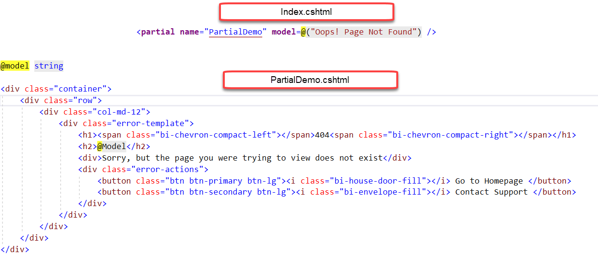
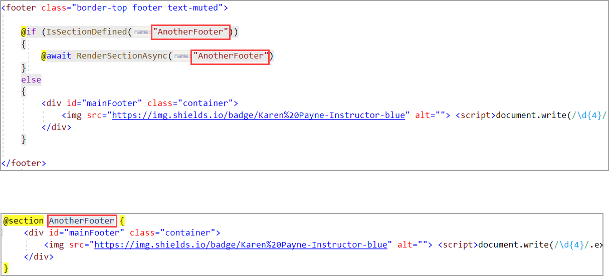

# About

## March 25th class topics

### Partial views in ASP.NET Core

A partial view is a Razor markup file (.cshtml) without an @page directive that renders HTML output within another markup file's rendered output.

Great for

- Break up large markup files into smaller components.
- Reduce the duplication of common markup content across markup files.

### RenderSectionAsync for ASP.NET Core

Sometimes you need to create HTML code in your view, which should be rendered on another location than the main parts of the view. This can be done with Sections. Sections are named areas in your view and usually used to put JavaScripts from your views in to a separate location, e.g. at the end of the page.

### Bootstrap 5 

- [Bootstrap 5 spacing](https://getbootstrap.com/docs/5.1/utilities/spacing/) *responsive margin, padding, and gap utility classes*
- [Bootstrap4/5 compatible modal dialog](https://github.com/GedMarc/bootstrap4-dialog)
- [Bootstrap's modal more monkey-friendly](file:///C:/OED/Dotnetland/VS2019/CreateExamples/RazorSolution/Demo1/node_modules/bootstrap4-dialog/examples/index.html) *model dialog without divs*
  - [Examples](http://nakupanda.github.io/bootstrap3-dialog/)